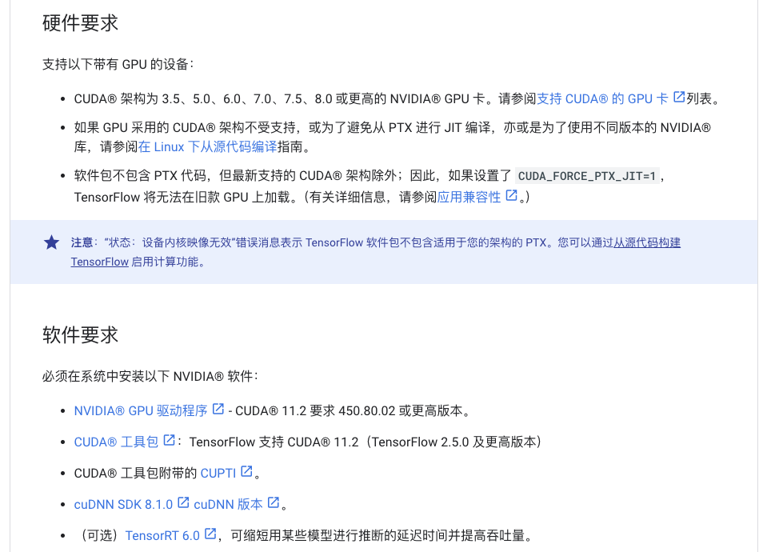
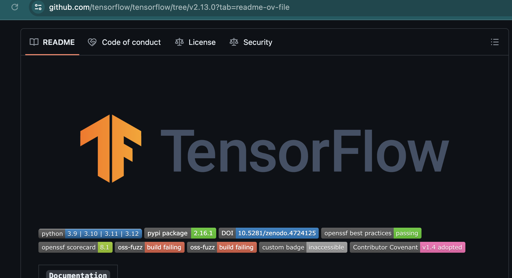
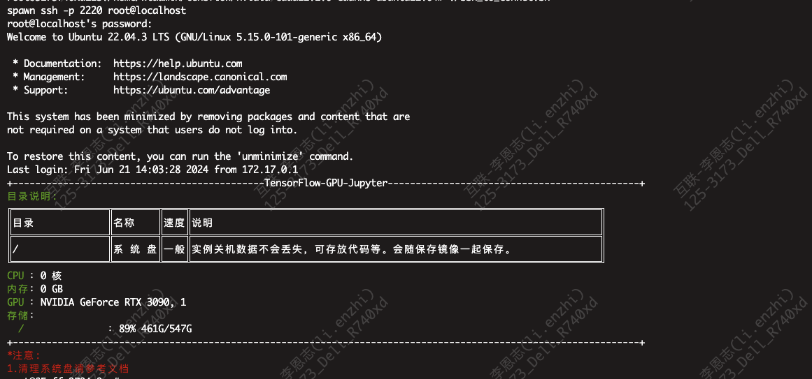
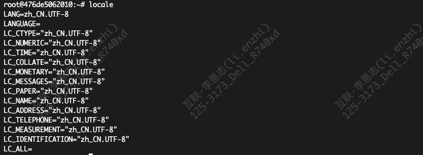

[TOC]

# TensorFlow Docker镜像指南

# 一、目标

​	本文档旨在说明tensorflow镜像构建过程。目标tensorflow镜像的要求是：支持ssh登录、root密码、中文支持、中国CST时区、支持moniconda、支持python3.10、支持Jupyterlab、支持tensorboard。
对于tensorflow不同版本来说，此构建过程是通用的。只要将构建镜像脚本中传入的基础镜像、各个版本参数改成自己需要的，即可按需构建不同版本的，支持GPU的或者仅支持CPU的镜像。具体参数详见“构建镜像”章节。

# 二、前提

2.1. Docker要求：已安装docker v19.03+<!--（从Docker 19.03版本开始，官方支持GPU加速，不再需要单独安装nvidia-docker）-->

2.2. TensorFlow 的 GPU 支持的硬件和软件要求见：https://www.tensorflow.org/install/gpu?hl=zh-cn#software_requirements



2.3. Tensorflow版本对于python版本支持

参考：https://tensorflow.google.cn/install/source?hl=zh-cn


对于更高版本的Tensorflow，参考github：https://github.com/tensorflow/tensorflow/tree/v2.13.0?tab=readme-ov-file



# 三、Dockerfile

```dockerfile
# 阶段1：基础镜像 + SSH及登录提示 + CST时区 + 中文支持
# 基于nvidia/cuda镜像开始构建（已包含cuda和cudnn）
ARG BASE_IMAGE
FROM ${BASE_IMAGE}

# 设置工作目录
WORKDIR /root

# 安装必要的工具
ENV DEBIAN_FRONTEND=noninteractive
RUN apt-get update && apt-get install -y \
    openssh-server \
    curl \
    vim \
    locales \
    supervisor \
    tzdata && apt-get clean && rm -rf /var/lib/apt/lists/*

# 设置ssh
RUN mkdir /var/run/sshd
RUN echo "root:123456" | chpasswd
RUN sed -i 's/#PermitRootLogin prohibit-password/PermitRootLogin yes/' /etc/ssh/sshd_config 

# 设置ssh登入提示信息
COPY matrixdc-motd /etc/matrixdc-motd
RUN echo 'source /etc/matrixdc-motd' >> /etc/bash.bashrc

# 暴露 SSH 端口
EXPOSE 22

# 设置时区
RUN ln -sf /usr/share/zoneinfo/Asia/Shanghai /etc/localtime && \
    echo "Asia/Shanghai" > /etc/timezone

# 设置中文
RUN locale-gen zh_CN.UTF-8
RUN echo 'export LANG=zh_CN.UTF-8' >> /root/.bashrc

# 设置必要环境变量
ENV SHELL=/bin/bash
ENV USER=root
ENV MOTD_SHOWN=pam

# 阶段2：安装miniconda3、python、jupyterlab、tensorboard
# 下载并安装 Miniconda，安装路径 /root/miniconda3
ENV PATH=/root/miniconda3/bin:$PATH
RUN curl -o /tmp/miniconda.sh -LO https://repo.anaconda.com/miniconda/Miniconda3-latest-Linux-x86_64.sh && \
    bash /tmp/miniconda.sh -b -p /root/miniconda3 && \
    rm /tmp/miniconda.sh && \
    echo "PATH=$PATH" >> /etc/profile

# 通过conda安装一个python
ARG PYTHON_VERSION
RUN conda install -y python=${PYTHON_VERSION}  && \
    conda clean -ya && \
    echo "export REQUESTS_CA_BUNDLE=/etc/ssl/certs/ca-certificates.crt" >> /etc/profile

# conda/pip增加国内源
RUN conda config --add channels https://mirrors.tuna.tsinghua.edu.cn/anaconda/pkgs/main/ && \
    conda config --add channels https://mirrors.tuna.tsinghua.edu.cn/anaconda/pkgs/free/ && \
    conda config --set show_channel_urls yes && \
    pip config set global.index-url http://mirrors.aliyun.com/pypi/simple/ && \
    pip config set global.trusted-host mirrors.aliyun.com

# 安装Python库
RUN pip install --upgrade pip \
    && pip install --no-cache-dir \
    jupyterlab \
    jupyterlab-language-pack-zh-CN \
    jupyterlab_pygments \
    tensorboard \
    && rm -r /root/.cache/pip
    
# 暴露 JupyterLab、TensorBoard的端口
EXPOSE 8888 6006

# 创建目录
RUN mkdir -p /init/boot

# 拷贝启动脚本
COPY boot.sh /init/boot/boot.sh
RUN chmod +x /init/boot/boot.sh

#启动服务
CMD ["bash", "/init/boot/boot.sh"]


# 阶段3：安装深度学习框架tensorflow
ARG TENSORFLOW_TYPE
ARG TENSORFLOW_VERSION
RUN pip install ${TENSORFLOW_TYPE}==${TENSORFLOW_VERSION}


```

# 四、Dockerfile中引用的文件

Dockerfile中涉及到2个其他文件：分别是：

<pre>
matrixdc-motd     ：SSH登录后提示信息。   
boot.sh           ：Dockerfile CMD启动文件
</pre>

## 4.1. matrixdc-motd：

​	位置：与Dockerfile同级目录

​	作用：用于ssh登入后显示的提示信息

```shell
#!/bin/bash
# 打印的文字颜色
RED='\033[0;31m'
GREEN='\033[0;32m'
default='\033[0m'
printf "+----------------------------------------------------------------------------------------------------------------+
"
printf "${GREEN}目录说明:${default}
"
printf "╔═════════════════╦════════╦════╦═════════════════════════════════════════════════════════════════════════╗
"
printf "║目录             ║名称    ║速度║说明                                                                     ║
"
printf "╠═════════════════╬════════╬════╬═════════════════════════════════════════════════════════════════════════╣
"
printf "║/                ║系 统 盘║一般║实例关机数据不会丢失，可存放代码等。会随保存镜像一起保存。               ║
"
printf "╚═════════════════╩════════╩════╩═════════════════════════════════════════════════════════════════════════╝
"

if test -f "/sys/fs/cgroup/cpu/cpu.cfs_quota_us"; then
  cfs_quota_us=$(cat /sys/fs/cgroup/cpu/cpu.cfs_quota_us)
  cfs_period_us=$(cat /sys/fs/cgroup/cpu/cpu.cfs_period_us)
  if [ $cfs_quota_us -ge $cfs_period_us ];then
      cores=$((cfs_quota_us / cfs_period_us))
  else
      cores=0.$((cfs_quota_us * 10 / cfs_period_us))
  fi
  printf "${GREEN}CPU${default} ：%s 核
" ${cores}

  limit_in_bytes=$(cat /sys/fs/cgroup/memory/memory.limit_in_bytes)
  memory="$((limit_in_bytes / 1024 / 1024 / 1024)) GB"
  printf "${GREEN}内存${default}：%s
" "${memory}"
else
  cores=$(cat /sys/fs/cgroup/cpu.max | awk '{print $1/$2}')
  printf "${GREEN}CPU${default} ：%s 核
" ${cores}

  limit_in_bytes=$(cat /sys/fs/cgroup/memory.max)
  memory="$((limit_in_bytes / 1024 / 1024 / 1024)) GB"
  printf "${GREEN}内存${default}：%s
" "${memory}"
fi

if type nvidia-smi >/dev/null 2>&1; then
  gpu=$(nvidia-smi -i 0 --query-gpu=name,count --format=csv,noheader)
  printf "${GREEN}GPU${default} ：%s
" "${gpu}"
fi

df_stats=`df -ah`
printf "${GREEN}存储${default}：
"
disk=$(echo "$df_stats" | grep "/$" | awk '{print $5" "$3"/"$2}')
printf "  ${GREEN}/${default}               ：%s
" "${disk}"


printf "+----------------------------------------------------------------------------------------------------------------+
"
printf "${RED}*注意: 
"
printf "${RED}1.清理系统盘请参考文档${default}
"

alias sudo=""

```

## 4.2. boot.sh：

​	位置：与Dockerfile同级目录

​	作用：定义要启动的服务，并用supervisor管理服务进程

```shell
#!/bin/bash

# 创建/init/jupyter，用来存放jupyterlab的配置文件
mkdir -p /init/jupyter

# 创建/init/supervisor，用来存放supervisor.ini文件
mkdir -p /init/supervisor

# 创建/root/tensorboard-logs，用来存放tensorboard日志
mkdir -p /root/tensorboard-logs

# 创建/init/jupyter/jupyter_config.py配置文件
cat > /init/jupyter/jupyter_config.py <<EOF
c.ServerApp.ip = '0.0.0.0'
c.ServerApp.port = 8888
# jupyter token设置
# c.ServerApp.token = ""
c.NotebookApp.open_browser = False

# 0.5.1版本前创建的容器还使用/ 作为root dir
import os
c.ServerApp.root_dir = "/root"
c.MultiKernelManager.default_kernel_name = 'python3'
c.NotebookNotary.db_file = ':memory:'
c.ServerApp.tornado_settings = {
    'headers': {
        'Content-Security-Policy': "frame-ancestors * 'self' "
    }
}
c.NotebookApp.allow_remote_access = True
c.NotebookApp.base_url='/jupyter/'
c.NotebookApp.allow_origin='*'

c.ServerApp.allow_remote_access = True
c.ServerApp.base_url='/jupyter/'
c.ServerApp.allow_origin='*'

EOF


# 创建/init/supervisor/supervisor.ini文件
cat > /init/supervisor/supervisor.ini <<EOF
[supervisord]
nodaemon=true
logfile=/tmp/supervisord.log
pidfile=/tmp/supervisord.pid


[program:sshd]
command=/usr/sbin/sshd
directory=/root
autostart=true
autorestart=true
redirect_stderr=true

[program:jupyterlab]
command=jupyter-lab --allow-root --config=/init/jupyter/jupyter_config.py
directory=/root
autostart=true
autorestart=true
redirect_stderr=true

[program:tensorboard]
command=tensorboard --host 0.0.0.0 --port 6006 --logdir /root/tensorboard-logs
directory=/root
autostart=true
autorestart=true
redirect_stderr=true

EOF

# 配置ssh密码
[ -f /sync/root-passwd ] && cat /sync/root-passwd | chpasswd && rm /sync/root-passwd


# 启动supervisord
supervisord -c /init/supervisor/supervisor.ini
```

# 五、构建镜像：

build-scripts.sh文件与Dockerfile放在同级目录下。此文件定义镜像构建过程，按需修改版本参数。构建出的镜像名称示例：tensorflow:2.15.0-python3.10-cuda12.1.0-cudnn8-devel-ubuntu22.04

注意：在给版本参数赋值时，参考对应tensorflow版本pip安装命令（https://tensorflow.google.cn/install/pip?hl=zh-cn）
!

对于tensorflow 1.15 及更早版本，CPU 和 GPU 软件包是分开的，例如：

```shell
pip install tensorflow==1.15      # CPU
pip install tensorflow-gpu==1.15  # GPU
```

对于tensorflow 2.x ，同时支持CPU和GPU，例如：

```shell
pip install tensorflow==2.15.0
```

build-scripts.sh内容如下：

```shell
#!/bin/sh
# 按照自己的需要，是否支持GPU/CUDA版本等选择基础镜像
# 如果是用构建支持GPU的，使用nvidia/cuda作为基础镜像；如果仅支持CPU，ubuntu作为基础镜像
# 例如：GPU的：nvidia/cuda:12.1.0-cudnn8-devel-ubuntu22.04，仅支持CPU的：ubuntu22.04

BASE_IMAGE=nvidia/cuda:12.1.0-cudnn8-devel-ubuntu22.04

PYTHON_VERSION=3.10
# 从 TensorFlow 2.1 开始，pip 包 tensorflow 即同时包含 GPU 支持，无需通过特定的 pip 包 tensorflow-gpu 安装 GPU 版本。
# 如果安装tensorflow-gpu:1.x版本,则TENSORFLOW_TYPE设为tensorflow-gpu，TENSORFLOW_VERSION设为1.x
TENSORFLOW_TYPE=tensorflow
TENSORFLOW_VERSION=2.15.0


# 构建后的镜像tag，需要体现tensorflow、python、基础镜像版本信息
IMAGE_TAG=${TENSORFLOW_VERSION}-python${PYTHON_VERSION}-cuda12.1.0-cudnn8-devel-ubuntu22.04

docker build \
    --build-arg BASE_IMAGE=${BASE_IMAGE} \
    --build-arg PYTHON_VERSION=${PYTHON_VERSION} \
    --build-arg TENSORFLOW_TYPE=${TENSORFLOW_TYPE} \
    --build-arg TENSORFLOW_VERSION=${TENSORFLOW_VERSION} \
    -t tensorflow:${IMAGE_TAG} \
    -f ./Dockerfile \
    .
```

执行镜像构建：

```shell
# 执行以下命令，即开始构建镜像
chmod +x build-scripts.sh
sh build-scripts.sh
```

# 六、运行Docker容器

## 6.1. 方式一：通过docker命令启动容器

docker-run.sh文件内容如下:

```shell
#!/bin/bash
# tensorflow:xxx需替换成构建好的实际镜像地址。
# 运行tensorflow容器，映射ssh 22端口为2222，jupyter端口为8888，tensorboard端口为6006
docker run  -d  -ti \
--restart=always \
--name tensorflow-test \
--gpus all --ipc=host \
-p 2220:22 \
-p 8880:8888 \
-p 6007:6006 \
tensorflow:2.15.0-python3.10-cuda12.1.0-cudnn8-devel-ubuntu22.04
```

## 6.2. 方式二：如果是k8s集群，可以通过deployment部署容器

部署命令：

```shell
kubectl apply -f your-deployment-example.yaml -f tensorflow-service-example.yaml
```

文件名：tensorflow-deployment-example.yaml

文件位置：./run-example/tensorflow-deployment-example.yaml

作用：部署deployment，用tensorflow镜像在k8s集群中部署服务

文件内容如下：

```yaml
apiVersion: apps/v1
kind: Deployment
metadata:
  name: tensorflow-example
spec:
  replicas: 1
  selector:
    matchLabels:
      app: tensorflow-example
  template:
    metadata:
      labels:
        app: tensorflow-example
    spec:
      # 测试时根据实际情况使用节点亲和性
      # affinity:
      #   nodeAffinity:
      #     requiredDuringSchedulingIgnoredDuringExecution:
      #       nodeSelectorTerms:
      #       - matchExpressions:
      #         - key: kubernetes.io/hostname
      #           operator: In
      #           values:
      #           - hostname
      containers:
      - image: tensorflow:2.15.0-python3.10-cuda12.1.0-cudnn8-devel-ubuntu22.04
        name: tensorflow-example
        ports:
        - containerPort: 22
          protocol: TCP
          name: ssh
        - containerPort: 8888
          protocol: TCP
          name: jupyterlab
        - containerPort: 6006
          protocol: TCP
          name: tensorboard
        resources:
          limits:
            cpu: "2"
            memory: 4Gi
          requests:
            cpu: 100m
            memory: 512Mi
```

文件名：tensorflow-service-example.yaml

文件位置：./run-example/tensorflow-service-example.yaml

作用：部署svc，用nodeport方式暴露服务端口，以便进行访问验证

文件内容如下：

```yaml
apiVersion: v1
kind: Service
metadata:
  name: tensorflow-example-service
spec:
  type: NodePort
  selector:
    app: tensorflow-example
  ports:
  - name: ssh
    protocol: TCP
    port: 22
    targetPort: 22
    nodePort: 30004 # 端口根据主机端口使用情况进行指定
  - name: jupyterlab
    protocol: TCP
    port: 8888
    targetPort: 8888
    nodePort: 30002 # 端口根据主机端口使用情况进行指定
  - name: tensorboard
    protocol: TCP
    port: 6006
    targetPort: 6006
    nodePort: 30003 # 端口根据主机端口使用情况进行指定
```

部署完成后，根据上述yaml节点端口暴露情况，在浏览器输入节点ip:30002，节点ip:30003，验证jupyter-lab和tensorboard是否能访问，或终端输入 ssh root@host -p 30004 验证是否能通过ssh登入容器。

# 七、验证镜像功能

## 7.1 ssh连接和ssh连接登入时提示：



## 7.2 时区验证-中国标准时间CTS:


## 7.3 支持中文验证:




## 7.4 Tensorflow、CUDA、CUDnn版本验证:


## 7.5 nvcc命令验证:


## 7.6 Jupyter lab页面访问验证：


## 7.7TensorBoard页面访问验证：

造测试数据：

```python
import tensorflow as tf
import numpy as np

# 创建一个简单的线性模型
def linear_model(x):
    return 2 * x + 1

# 生成一些数据点
x = np.linspace(0, 10, 100)
y = linear_model(x) + np.random.normal(0, 1, 100)  # 添加一些噪声

# 创建一个TensorFlow的summary writer
log_dir = "/root/tensorboard-logs"
writer = tf.summary.create_file_writer(log_dir)

# 记录数据
with writer.as_default():
    for epoch in range(100):
        # 假设我们有一个损失函数，我们想记录它的值
        loss = np.random.random()
        tf.summary.scalar('loss', loss, step=epoch)
        writer.flush()
```


## 7.8 TensorFlow验证：

python3 -c "import tensorflow as tf; print(tf.reduce_sum(tf.random.normal([1000, 1000])))"


# 八、构建好的新镜像

| 镜像名     | tag                                                   | 镜像id       | 备注                                                         |
| ---------- | ----------------------------------------------------- | ------------ | ------------------------------------------------------------ |
| tensorflow | 2.15.0-python3.10-cuda12.1.0-cudnn8-devel-ubuntu22.04 | 676d6aebe1cf | 1.     镜像tag中体现了Tensorflow、cuda、cudnn、python、ubuntu等版本信息<br>2.     安装常用包如vim、curl等<br>3.     增加root用户ssh登录，临时密码为111111<br/>4.     修改时区为中国标准时间<br/>5.     安装中文支持并生成中文locale<br/>6.     安装python库pandas、seaborn<br/>7.     增加ssh登入提示信息 |

# 九、镜像目录说明

1. 登入容器目录：/root
2. jupyter工作目录：/root
3. TensorBoard日志目录：/root/tensorboard-logs

# 十、扩展说明

主要参考以下网站：

1. nvidia-cuda docker hub地址：https://hub.docker.com/r/nvidia/cuda/tags?page=&page_size=&ordering=&name=12.1.0-cudnn8-devel-ubuntu

2. Tensorflow官网地址：https://www.tensorflow.org/install?hl=zh-cn

3. Tensorflow GitHub地址：https://github.com/tensorflow/tensorflow/tree/v2.15.0/tensorflow/tools

4. TensorBoard教程地址：https://tensorflow.google.cn/tensorboard/get_started?hl=zh-cn

   
