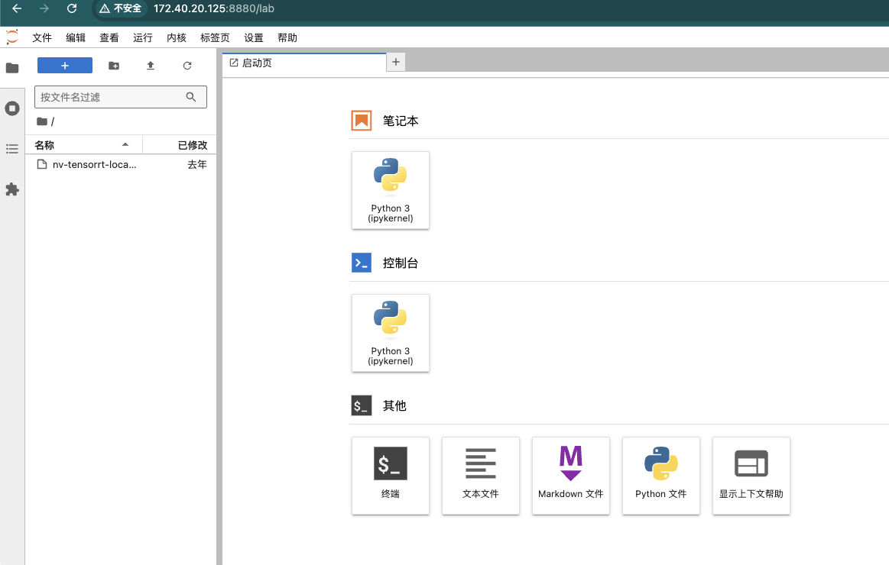

[TOC]

# TensorFlow Docker镜像指南

# 一、目标

​	本文档旨在说明tensorflow镜像构建过程。目标tensorflow镜像的要求是：支持ssh登录、root密码、中文支持、中国CST时区、支持moniconda、支持python3.10、支持Jupyterlab、支持tensorboard。
对于tensorflow不同版本来说，此构建过程是通用的。只要将构建镜像脚本中传入的基础镜像、各个版本参数改成自己需要的，即可按需构建不同版本的，支持GPU的或者仅支持CPU的镜像。具体参数详见“构建镜像”章节。

# 二、前提

2.1. Docker要求：已安装docker v19.03+<!--（从Docker 19.03版本开始，官方支持GPU加速，不再需要单独安装nvidia-docker）-->

2.2. TensorFlow 的 GPU 支持的硬件和软件要求见：https://www.tensorflow.org/install/gpu?hl=zh-cn#software_requirements


2.3. Tensorflow版本对于python版本支持

参考：https://tensorflow.google.cn/install/source?hl=zh-cn


对于更高版本的Tensorflow，参考github：https://github.com/tensorflow/tensorflow/tree/v2.13.0?tab=readme-ov-file


# 三、Dockerfile

```dockerfile
# 阶段1：基础镜像 + SSH及登录提示 + CST时区 + 中文支持
# 基于nvidia/cuda镜像开始构建（已包含cuda和cudnn）
ARG BASE_IMAGE
FROM ${BASE_IMAGE}

# 设置工作目录
WORKDIR /root

# 设置必要环境变量
ENV SHELL=/bin/bash
ENV USER=root
ENV MOTD_SHOWN=pam

# 安装必要的工具
ENV DEBIAN_FRONTEND=noninteractive
RUN apt-get update && apt-get install -y --no-install-recommends \
    openssh-server \
    curl \
    vim \
    tmux \
    wget \
    locales \
    tzdata && apt-get clean && rm -rf /var/lib/apt/lists/*
    
# 设置时区
RUN ln -sf /usr/share/zoneinfo/Asia/Shanghai /etc/localtime && \
    echo "Asia/Shanghai" > /etc/timezone

# 设置中文
RUN locale-gen zh_CN.UTF-8
RUN echo 'export LANG=zh_CN.UTF-8' >> /root/.bashrc

# SSH支持，SSH登录提示信息放在/etc/matrixdc-motd
RUN mkdir /var/run/sshd && \
    echo "root:123456" | chpasswd && \
    sed -i 's/#PermitRootLogin prohibit-password/PermitRootLogin yes/' /etc/ssh/sshd_config && \
    echo "PasswordAuthentication yes" >> /etc/ssh/sshd_config && \
    echo "source /etc/profile" >> /root/.bashrc && \
    echo "source /etc/matrixdc-motd" >> /root/.bashrc
    
# 暴露 SSH 端口
EXPOSE 22

# 阶段2：安装miniconda3(已内置指定python)、jupyterlab、tensorboard
# 下载并安装 Miniconda，安装路径 /root/miniconda3
ARG MINICONDA_PKG
ENV PATH=/root/miniconda3/bin:$PATH
RUN curl -o /tmp/miniconda.sh -LO https://repo.anaconda.com/miniconda/${MINICONDA_PKG} && \
    bash /tmp/miniconda.sh -b -p /root/miniconda3 && \
    rm /tmp/miniconda.sh && \
    echo "PATH=$PATH" >> /etc/profile

# pip安装jupyterLab、tensorboard，tensorboard依赖的numpy版本需要小于2.0
RUN pip install --upgrade pip && pip install 'numpy<2.0' jupyterlab jupyterlab-language-pack-zh-CN jupyterlab_pygments tensorboard

# pip安装tensorrt
ARG TENSORRT_VERSION
ARG CU_VERSION
RUN	pip install wheel && \
		pip install --upgrade tensorrt${CU_VERSION}==${TENSORRT_VERSION} && \
		pip install --upgrade tensorrt_lean && \
		pip install --upgrade tensorrt_dispatch && \
    rm -r /root/.cache/pip && \
    # 添加软连接，不添加会报错：not found tensorrt
    ln $(find / -name libnvinfer.so*) /usr/lib/libnvinfer.so.${TENSORRT_VERSION} && \
    ln $(find / -name libnvinfer_plugin.so.*) /usr/lib/libnvinfer_plugin.so.${TENSORRT_VERSION}

# 暴露 JupyterLab、TensorBoard的端口
EXPOSE 8888 6006

# 创建目录
RUN mkdir -p /init/

# 拷贝启动涉及到的文件
COPY ./init/ /init/
RUN chmod 755 /init/boot/*.sh && chmod 755 /init/bin/*

#启动服务
CMD ["bash", "/init/boot/boot.sh"]


# 阶段3：安装深度学习框架tensorflow
ARG TENSORFLOW_TYPE
ARG TENSORFLOW_VERSION
RUN pip install ${TENSORFLOW_TYPE}==${TENSORFLOW_VERSION}


```

# 四、Dockerfile中引用的文件

Dockerfile中引用了init/文件夹

init文件夹存放在github的common目录下：https://github.com/matrix-dc/mlops-images/tree/main/common/   

注意：构建镜像时，init整个文件夹与Dockerfile放在同级目录下。    
文件夹目录结构如下：

<pre>
/init/
├── bin
│   └── supervisord   #supervisor二进制bin文件，静态文件
├── boot
    └── boot.sh       # CMD启动脚本，静态文件

</pre>

## 4.1 ./init/bin/supervisord

./init/bin/supervisord是个bin文件，在boot.sh中用此supervisord启动服务。

## 4.2. ./init/boot/boot.sh

/init/boot/boot.sh是CMD启动脚本，此脚本中通过curl的方式获取在线文件start.sh，start.sh脚本中其中一个步骤是通过curl获取在线文件init.py，这样组织的好处是：start.sh、init.py文件内容有变化时无需重新Build镜像。        
1、start.sh    
start.sh文件存放在github：https://github.com/matrix-dc/mlops-images/blob/main/common/online-files/start.sh              
start.sh在线地址：https://sharefile.43.143.130.168.nip.io:30443/file/start.sh               
2、init.py   
init.py文件存放在github：https://github.com/matrix-dc/mlops-images/blob/main/common/online-files/init.py                 
init.py在线地址：https://sharefile.43.143.130.168.nip.io:30443/file/init.py                

# 五、构建镜像：

build-scripts.sh文件与Dockerfile放在同级目录下。此文件定义镜像构建过程，按需修改版本参数。构建出的镜像名称示例：tensorflow:2.15.0-python3.10-cuda12.1.0-cudnn8-devel-ubuntu22.04

注意：在给版本参数赋值时，参考对应tensorflow版本pip安装命令（https://tensorflow.google.cn/install/pip?hl=zh-cn）
!

对于tensorflow 1.15 及更早版本，CPU 和 GPU 软件包是分开的，例如：

```shell
pip install tensorflow==1.15      # CPU
pip install tensorflow-gpu==1.15  # GPU
```

对于tensorflow 2.x ，同时支持CPU和GPU，例如：

```shell
pip install tensorflow==2.15.0
```

build-scripts.sh内容如下：

```shell
#!/bin/sh
# 按照自己的需要，是否支持GPU/CUDA版本等选择基础镜像
# 如果是用构建支持GPU的，使用nvidia/cuda作为基础镜像；如果仅支持CPU，ubuntu作为基础镜像
# 例如：GPU的：nvidia/cuda:12.1.0-cudnn8-devel-ubuntu22.04，仅支持CPU的：ubuntu22.04

BASE_IMAGE=nvidia/cuda:12.1.0-cudnn8-devel-ubuntu22.04

PYTHON_VERSION=3.10
# miniconda的安装包均放在：https://repo.anaconda.com/miniconda/。根据要安装的python版本、操作系统，选择对应的miniconda安装包。
MINICONDA_PKG=Miniconda3-py310_24.5.0-0-Linux-x86_64.sh

# tensorRT pip安装tensorRT后，需要指定软连接到/usr/lib下，否则会报tensorRT not found
TENSORRT_VERSION=8.6.1
CU_VERSION='' # 如果不填默认-cu12，也可指定-cu11

# 从 TensorFlow 2.1 开始，pip 包 tensorflow 即同时包含 GPU 支持，无需通过特定的 pip 包 tensorflow-gpu 安装 GPU 版本。
# 如果安装tensorflow-gpu:1.x版本,则TENSORFLOW_TYPE设为tensorflow-gpu，TENSORFLOW_VERSION设为1.x
TENSORFLOW_TYPE=tensorflow
TENSORFLOW_VERSION=2.15.0


# 构建后的镜像tag，需要体现tensorflow、python、基础镜像版本信息
IMAGE_TAG=${TENSORFLOW_VERSION}-python${PYTHON_VERSION}-cuda12.1.0-cudnn8-devel-ubuntu22.04

docker build \
    --build-arg BASE_IMAGE=${BASE_IMAGE} \
    --build-arg PYTHON_VERSION=${PYTHON_VERSION} \
    --build-arg MINICONDA_PKG=${MINICONDA_PKG} \
    --build-arg TENSORRT_VERSION=${TENSORRT_VERSION} \
    --build-arg CU_VERSION=${CU_VERSION} \
    --build-arg TENSORFLOW_TYPE=${TENSORFLOW_TYPE} \
    --build-arg TENSORFLOW_VERSION=${TENSORFLOW_VERSION} \
    -t tensorflow:${IMAGE_TAG} \
    -f ./Dockerfile \
    .
```

执行镜像构建：

```shell
# 执行以下命令，即开始构建镜像
chmod +x build-scripts.sh
sh build-scripts.sh
```

# 六、运行Docker容器

## 6.1. 方式一：通过docker命令启动容器

docker-run.sh文件内容如下:

```shell
#!/bin/bash
# tensorflow:xxx需替换成构建好的实际镜像地址。
# 运行tensorflow容器，映射ssh 22端口为2222，jupyter端口为8888，tensorboard端口为6006
docker run  -d  -ti \
--restart=always \
--name tensorflow-test \
--gpus all --ipc=host \
-p 2222:22 \
-p 8888:8888 \
-p 6006:6006 \
tensorflow:2.15.0-python3.10-cuda12.1.0-cudnn8-devel-ubuntu22.04
```

## 6.2. 方式二：如果是k8s集群，可以通过deployment部署容器

部署命令：

```shell
kubectl apply -f your-deployment-example.yaml -f tensorflow-service-example.yaml
```

文件名：tensorflow-deployment-example.yaml

文件位置：./run-example/tensorflow-deployment-example.yaml

作用：部署deployment，用tensorflow镜像在k8s集群中部署服务

文件内容如下：

```yaml
apiVersion: apps/v1
kind: Deployment
metadata:
  name: tensorflow-example
spec:
  replicas: 1
  selector:
    matchLabels:
      app: tensorflow-example
  template:
    metadata:
      labels:
        app: tensorflow-example
    spec:
      # 测试时根据实际情况使用节点亲和性
      # affinity:
      #   nodeAffinity:
      #     requiredDuringSchedulingIgnoredDuringExecution:
      #       nodeSelectorTerms:
      #       - matchExpressions:
      #         - key: kubernetes.io/hostname
      #           operator: In
      #           values:
      #           - hostname
      containers:
      - image: tensorflow:2.15.0-python3.10-cuda12.1.0-cudnn8-devel-ubuntu22.04
        name: tensorflow-example
        ports:
        - containerPort: 22
          protocol: TCP
          name: ssh
        - containerPort: 8888
          protocol: TCP
          name: jupyterlab
        - containerPort: 6006
          protocol: TCP
          name: tensorboard
        resources:
          limits:
            cpu: "2"
            memory: 4Gi
          requests:
            cpu: 100m
            memory: 512Mi
```

文件名：tensorflow-service-example.yaml

文件位置：./run-example/tensorflow-service-example.yaml

作用：部署svc，用nodeport方式暴露服务端口，以便进行访问验证

文件内容如下：

```yaml
apiVersion: v1
kind: Service
metadata:
  name: tensorflow-example-service
spec:
  type: NodePort
  selector:
    app: tensorflow-example
  ports:
  - name: ssh
    protocol: TCP
    port: 22
    targetPort: 22
    nodePort: 30004 # 端口根据主机端口使用情况进行指定
  - name: jupyterlab
    protocol: TCP
    port: 8888
    targetPort: 8888
    nodePort: 30002 # 端口根据主机端口使用情况进行指定
  - name: tensorboard
    protocol: TCP
    port: 6006
    targetPort: 6006
    nodePort: 30003 # 端口根据主机端口使用情况进行指定
```

部署完成后，根据上述yaml节点端口暴露情况，在浏览器输入节点ip:30002，节点ip:30003，验证jupyter-lab和tensorboard是否能访问，或终端输入 ssh root@host -p 30004 验证是否能通过ssh登入容器。

# 七、验证镜像功能

## 7.1 ssh连接和ssh连接登入时提示：


## 7.2 时区验证-中国标准时间CTS:


## 7.3 支持中文验证:


## 7.4 Tensorflow、CUDA、CUDnn版本验证:


## 7.5 nvcc命令验证:


## 7.6 Jupyter lab页面访问验证：




## 7.7TensorBoard页面访问验证：

造测试数据：

```python
import tensorflow as tf
import numpy as np

# 创建一个简单的线性模型
def linear_model(x):
    return 2 * x + 1

# 生成一些数据点
x = np.linspace(0, 10, 100)
y = linear_model(x) + np.random.normal(0, 1, 100)  # 添加一些噪声

# 创建一个TensorFlow的summary writer
log_dir = "/root/tensorboard-logs"
writer = tf.summary.create_file_writer(log_dir)

# 记录数据
with writer.as_default():
    for epoch in range(100):
        # 假设我们有一个损失函数，我们想记录它的值
        loss = np.random.random()
        tf.summary.scalar('loss', loss, step=epoch)
        writer.flush()
```


## 7.8 TensorFlow验证：

python3 -c "import tensorflow as tf; print(tf.reduce_sum(tf.random.normal([1000, 1000])))"


# 八、构建好的新镜像

| 镜像名     | tag                                                   | 镜像id       | 镜像大小 | 备注                                                         |
| ---------- | ----------------------------------------------------- | :----------- | -------- | ------------------------------------------------------------ |
| tensorflow | 2.15.0-python3.10-cuda12.1.0-cudnn8-devel-ubuntu22.04 | 659281294a52 | 12.5G    | 1.     镜像tag中体现了Tensorflow、cuda、cudnn、python、ubuntu等版本信息<br>2.     安装常用包如vim、curl等<br>3.     增加root用户ssh登录，临时密码为111111<br/>4.     修改时区为中国标准时间<br/>5.     安装中文支持并生成中文locale<br/>6.     安装python库pandas、seaborn<br/>7.     增加ssh登入提示信息 |

# 九、镜像目录说明

1. 登入容器目录：/root，ssh  root用户默认密码：123456
2. jupyter工作目录：/root，访问根路径：/jupyter
3. TensorBoard日志目录：/root/tensorboard-logs，访问根路径：/monitor

# 十、扩展说明

主要参考以下网站：

1. nvidia-cuda docker hub地址：https://hub.docker.com/r/nvidia/cuda/tags?page=&page_size=&ordering=&name=12.1.0-cudnn8-devel-ubuntu

2. Tensorflow官网地址：https://www.tensorflow.org/install?hl=zh-cn

3. Tensorflow GitHub地址：https://github.com/tensorflow/tensorflow/tree/v2.15.0/tensorflow/tools

4. TensorBoard教程地址：https://tensorflow.google.cn/tensorboard/get_started?hl=zh-cn

   
